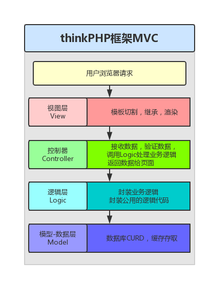

# thinkPHP中的Model，Logic和Service   
Model 是thinkPHP的MVC中的模型层(M),简单的来说就是对数据库数据的各种操作(CURD)。

## 模型层   
> 模型类并非必须定义，只有当存在独立的业务逻辑或者属性的时候才需要定义。

* 在thinkPHP中对模型的定义时这样说，但是结合其他一些框架和开发经验来说，这样的定义在针对快速开发，小型项目时结合thinkPHP中的M方法和D方法开发速度会比较快。

* 但是，在我开发的过程中发现一味的这么简单的使用总是给人一种感觉：MVC->VC，也就是说:模型-视图-控制器 这样的结构变成了：视图-控制器。所有的业务逻辑和数据操作都放在控制器中，这样总是给人感觉控制器太重了，完全没有做到分层，很多时候你会看到一个控制器长到有一百多两百行代码。   

* thinkPHP提供的这样的M和D方法有时候是帮助提高了我们开发的速度，但是如果在理想的情况下thinkPHP中的M和D方法完全满足了我们，我们难道就没必要写Model了吗？ 我觉得完全不是这样！在我目前这个项目中每一个控制器中需要的数据库操作都是用M或者D方法来完成，似乎是方便快速！但是这样产生几个问题：
    > 1. 没有明确控制器的职责，也就是你控制器做的事情太多了（控制器太重了）
    > 2. 数据库操作代码复用性差，仔细想想：很多时候不同的控制器会有一些相同的数据库操作，而我们确实重复的写了另一个控制器中的代码（也许你是相对聪明的，知道程序员神奇：Ctrl+c和Ctrl+v）
    > 3. 一旦我们的数据稍有修改，你不得不检查每一个控制器，因为说不定你的这个小小的修改会在那个控制器中跳出bug。但是如果我们使用了Model，这样我们做到了分层：数据库变更了，你只需要修改对应的Model模型中的方法就行，似乎跟没有修改一样完美。

## 充分利用好thinkPHP提供的Model，Logic和Servic   

要想能够利用好这些，我们最好还是先来做好下面这几点，因为只有这样，MVC的职责清晰了，你才会清楚的知道：我接下来要写的代码应该在那个文件中出现！

* 控制器：控制器应该尽量精简，他只做：a.前台数据的接受; b.数据的验证与过滤; c.调用Logic层做业务处理或者调用Model层操作数据库; d.将拿到的数据assign到前端页面或者Ajax返回    

* 模型层（Model）：a.数据自动验证; b.自动完成; c.数据库原子操作（CURD）; d.各种特殊操作（比如：对于所有的写操作默认开启事务); e.缓存存取    

* Logic: 定义用户相关的业务逻辑。尽量将公用方法抽取出来，应该注意：抽取出来的方法应该功能专一，具有复用性；这也是所有方法应该注意的地方，不要想着方法应该包含一万种可能，如果这样你写出的方法必然不是专一的，且参数有一万种可能，bug也是一万种，因为我们没有办法考虑那么周全。我们在写业务的时候，只抽取一个很专一的逻辑为一个方法，可以抽取多个方法，但请一定要保持这个方法只干一件事情，且他的在写其他的方法。    

* 视图（view）：这个不用说了，就是使用模板引擎渲染输出。但是请注意：不要php和模板引擎的语法混合使用，建议尽量使用模板引擎的语法。   

## 图示

## 总结

目前理解只限于这样的一个层次，在后续的thinkPHP使用中，会根据个人理解和经验来继续丰富完善。  

